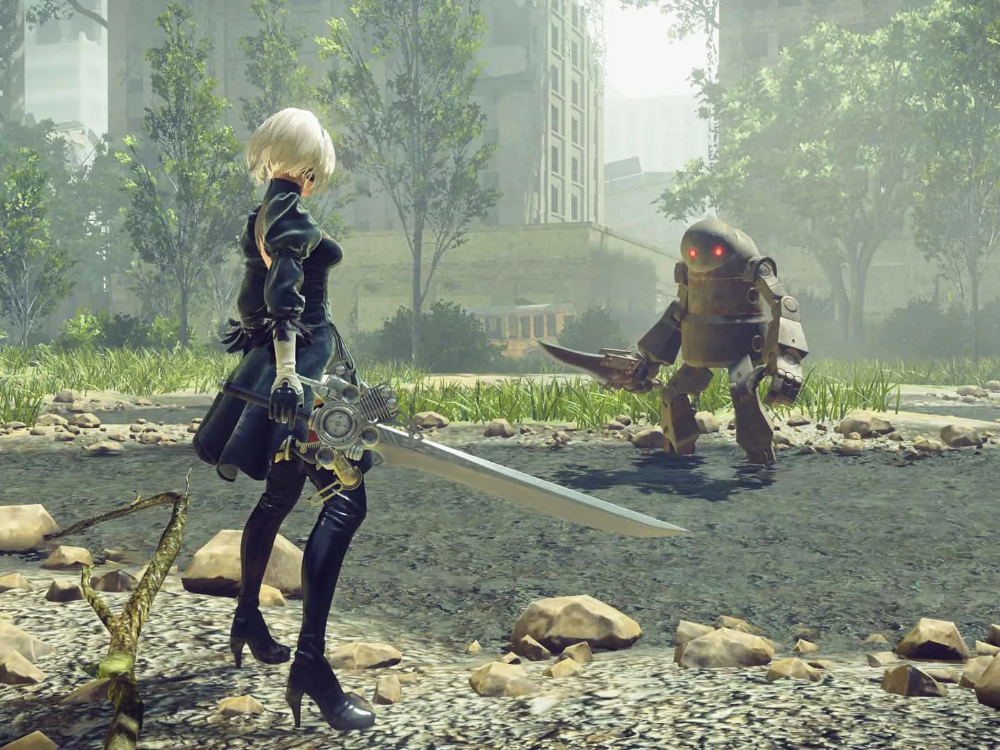
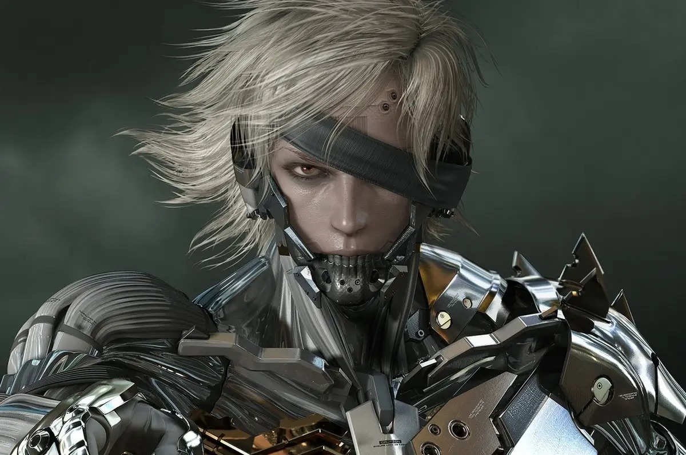
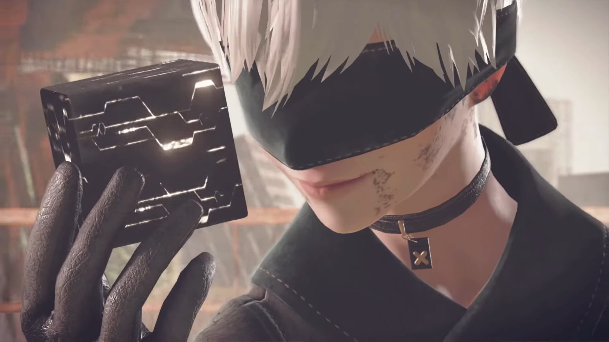
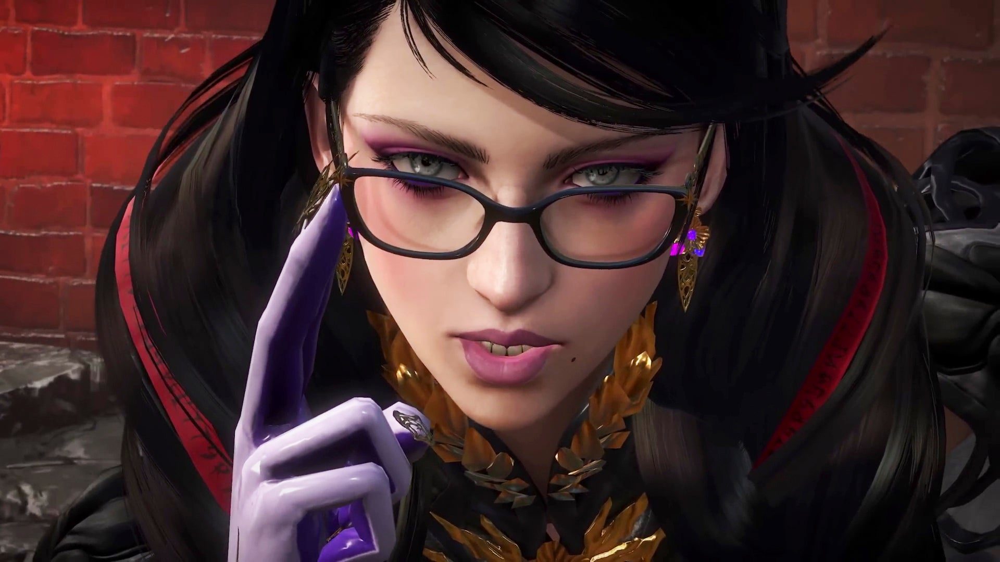

<h2>DOHA's Favorite Game</h2>

- **Name:** NieR:Automata
- **Great things about the game:** It has such a great graphic visuals! All of their sound tracks are so beautiful and touching. I never felt beautiful when I was in combats in other games, but playing this game, I really felt lots of satisfaction and eexcitement from the beauty of their fantastic visuals.
- **Developers:** [Platinum Games](https://www.platinumgames.com), [Square Enix](https://www.square-enix-games.com/en_US/home)
- **Publisher:** [Square Enix](https://www.square-enix-games.com/en_US/home)
-  **Release date:**  February 23, 2017
-  **Game Engine:** Unreal 5.1
-  **A list of similar or related games**
	1. 	[Metal Gear Rising](https://www.platinumgames.com/games/metal-gear-rising-revengeance) (Platinum Games)
		

	2. [Drakengard 3](http://www.accessgames.co.jp/en/products/dod3.html) (Access Games)
		

	3. [Bayonetta](https://www.platinumgames.com/games/bayonetta) (Platinum Games)
		

